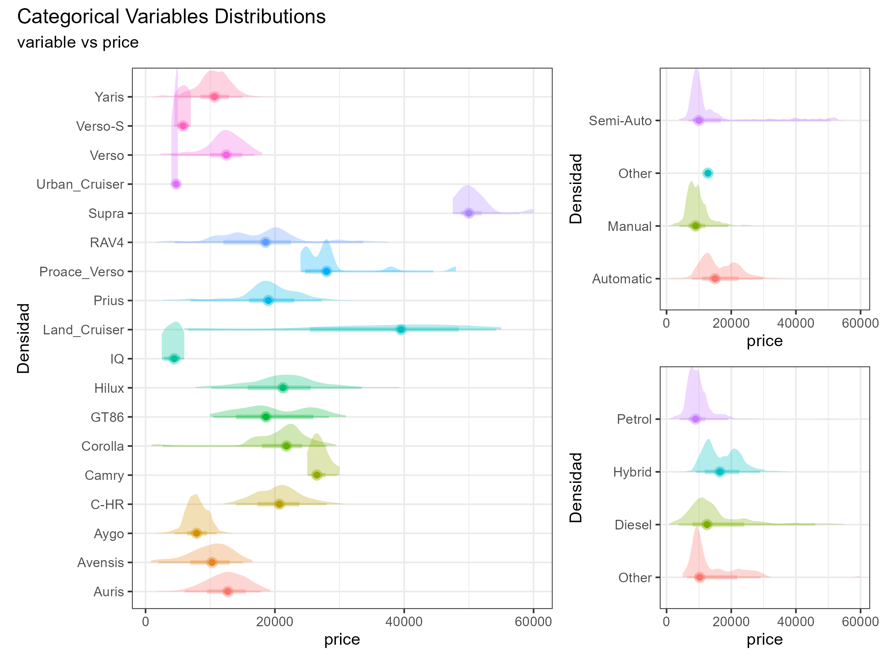
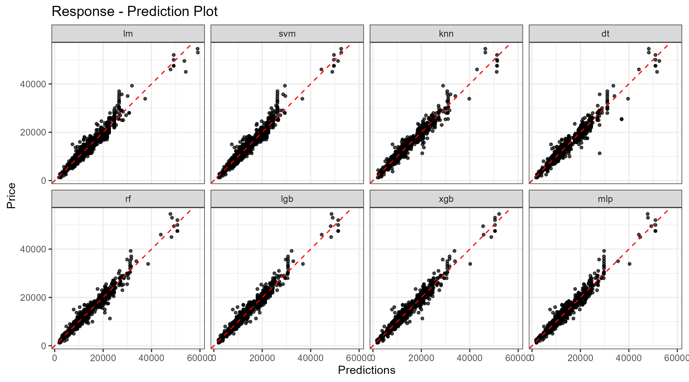
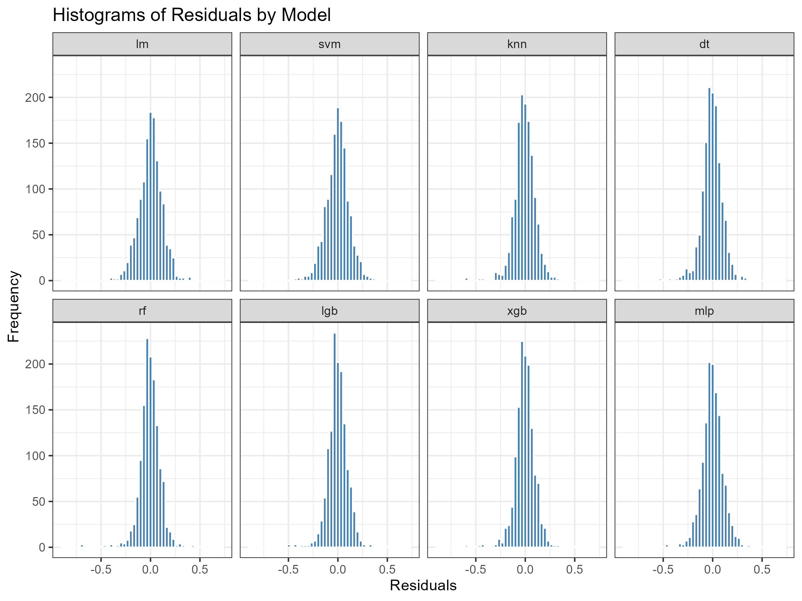
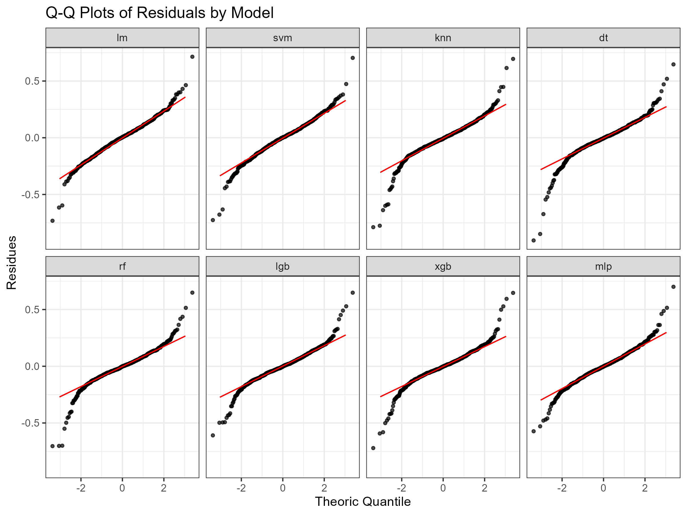

<!-- Bloque de CSS  -->
<style>
.lightable-classic {
  margin: 0px 5px 25px !important;  /* Ajusta el margen inferior a 20px */
}
</style>
# Setup
## Packages
```{r load_packages, include=FALSE}
knitr::opts_chunk$set(echo = TRUE, message = FALSE)
library(DiagrammeR)     # Mermaid Graph library
library(tidyverse)      # Data analysis related libraries
library(kableExtra)     # Table render library
```
## Import Data
```{r import_data, include=FALSE}
raw <- readRDS("./data/01_raw.rds")
load("./data/02_validated.RDATA")
load("./data/03_explore.RData")
load("./data/04_correlations.RData")
load("./data/06_metrics.RData")
```
## Code
The code, output datasets, and diagrams are arranged in parallel with the index of this document.
```{r tree, echo = FALSE}
# Ejecutar el comando tree con el parámetro /F para incluir archivos
output <- system("tree /F", intern = TRUE)

# Convertir la salida a UTF-8
output_utf8 <- iconv(output[-(1:3)], from = "CP1252", to = "UTF-8")

# Mostrar la salida
cat(output_utf8, sep = "\n")
```
# Data Analysis Framework
## Question/Problem Statement
This document will describe each step of the process that allows achieving the objectives of the exercise, both trivial aspects and aspects related to decision-making with a subjective component.

> The objective is to complete the exercise requirements, which involve analyzing the data, modeling the used vehicle price estimation with an accuracy within 10%, and sharing the results.

## Structure of Information
Each step of the process is performed using R code in files located in the _scripts_ folder, numbered to follow a reading sequence. The input information and summary of the analysis processes are located in the _data_ folder and in the _figures_ folder. This document serves as a presentation layer for the results.

This exercise uses Tidiverse as ecosystem for data analysis, also consistent withe [Tidyverse style guide](https://style.tidyverse.org/). For modelling takes an approach not featured in the DataCamp courses, Tidymodels, although it is mentioned in one blog.

## Workflow
```{r work-flow, echo = FALSE, fig.align = 'center', fig.dim = c(5, 7)}
# Crear el diagrama Mermaid
mermaid("
    graph LR
        A[Preliminary Analysis]
        B[Exploratory Analysis]
        C[Pre-Processing Analysis]
        D[Machine Learning Modelling]
        
        A --> B
        B --> C
        C --> D
    ",
    height = 100,
    width = '100%')
```

# Preliminary Analysis

```{r preliminary-work-flow, echo=FALSE, fig.align='center'}
# Crear el diagrama Mermaid
mermaid("
    graph LR
        A[Load Data<br><small>./scripts/01_load.R</small>]
        A --> B[Data Validation<br><small>./scripts/02_validations.R</small>]
        B --> C[Exploratory Analysis<br><small>./scripts/03_explore.R</small>]
    ",
    height = '100%',
    width = '100%')
```
## Load Data
The script in the file _01_load_data.R_ loads the dataset in CSV format, from the [path](https://s3.amazonaws.com/talent-assets.datacamp.com/toyota.csv) (indicated in the exercise), performs a minimal transformation to contain the information in an object of the _dataframe_ class, and saves the data in the file _01_raw.rds_ for later use in the _data_ folder.

## Data Validation
The analysis aimed at analyzing the quality of the data is carried out in the file _02_validation.R_, performing the following actions:
```{r data-validations, echo=FALSE, fig.align='center'}
# Crear el diagrama Mermaid
mermaid("
    graph TB
        A[Identify NA values] 
        A --> B[Validation on Categorical Variables] 
        B --> C[Check unique text by categorical variables] 
        C --> D[Factorize Text Variables] 
        A --> E[Validation on Numeric Variables] 
        E --> F[Negative values check] 
        F --> G[Zero values check] 
        G --> H[Corrections on <i>engineSize</i> = 0] 
        H --> I[Save corrected Dataset] 
        D --> I
    ",
    height = '100%',
    width = '100%')
```
The reviews show that the data is almost clean and only anomalies appeared in the _engineSize_ variable. Additionaly, minor formatting issues in the _model_ variable have been standardized. 

Additionally, text variables were defined as factors.

### Missing Values
There are no missing values in the Dataset.
```{r missing-values, echo = FALSE}
missing_values %>% 
    kbl(caption = "Missing Values") %>%
    kable_classic(full_width = F, html_font = "Cambria", position = "left")
```
### Text Variables Validation
A review of the text-type variables reveals that the _model_ field contains strings with spaces, which need to be corrected for further analysis. It is also noted that the strings do not contain special characters, except for the "-" sign, which does not pose any issues. Finally, an inconsistency is observed in the string *PROACE VERSO*, as it is in uppercase letters, unlike the rest of the models.


```{r, echo = FALSE}
unique_strings %>% 
    kbl(caption = "Unique Strings") %>%
    kable_classic(full_width = F, html_font = "Cambria", position = "left")
```
Once the spacing and formatting issues have been corrected, the text variables will be transformed to be used as factors for further analysis.

Since economic processes like inflation or asset depreciation occur continuously over time, date data should be treated as integer-type numeric data. Therefore, the _year_ field will not be converted into a factor.

### Numeric Variables Validation
In numeric variables, the review consists of locating atypical values: negative values and zero values.
```{r negative_values, echo = FALSE}
negative_values %>% 
    kbl(caption = "Number of Negative Values") %>%
    kable_classic(full_width = F, html_font = "Cambria", position = "left")
```
```{r zero_values, echo = FALSE}
zero_values %>% 
    kbl(caption = "Number of Zero Values") %>%
    kable_classic(full_width = F, html_font = "Cambria", position = "left")
```
Zero values in the tax field do not exhibit any unusual patterns, and most instances correspond to hybrid models. It is plausible to consider these as cases of government incentives, which do not require any correction.
```{r tax-exception, echo = FALSE}
raw %>% 
    filter(tax == 0) %>% 
    count(fuelType) %>% 
    kbl(caption = "Tipos de vehículo con Tax = 0") %>%
    kable_classic(full_width = FALSE, html_font = "Cambria", position = "left") %>% 
    column_spec(1, width = "150px")
```
On the other hand, since an engine's size cannot be zero, this is clearly an error in the data. The necessary correction involves identifying the patterns of the six exceptions found.
```{r engineSize0, echo = FALSE}
raw %>% 
    filter(engineSize == 0) %>% 
    kbl(caption = "Anomaly engineSize = 0") %>%
    kable_classic(full_width = F, html_font = "Cambria", position = "left")
```
The details reveal that these cases share the variables _model_, _year_, and _fuelType_. Therefore, filtering by each of these groups will help narrow down the variants.
```{r variants-engineSize, echo = FALSE}
raw %>%
    semi_join(
        raw %>%
            filter(engineSize == 0) %>%
            select(model, year, fuelType) %>%
            distinct(),
        by = c("model", "year", "fuelType")
    ) %>%
    select(model, year, fuelType, engineSize) %>%
    distinct() %>% 
    kbl(caption = "Options where engineSize = 0") %>%
    kable_classic(full_width = F, html_font = "Cambria", position = "left")
```
Only the *C-HR* model presents more than one possibility, so it is necessary to expand the grouping with the _transmission_ variable.
```{r CHR-exception, echo = FALSE}
raw %>% 
    filter(model == "C-HR" & 
           year == 2017 & 
           transmission == "Manual" & 
           fuelType == "Petrol"
           ) %>% 
    select(model, year, transmission, fuelType, engineSize) %>%
    distinct()  %>% 
    kbl(caption = "C-HR exception") %>%
    kable_classic(full_width = F, html_font = "Cambria", position = "left")
```
This approach allows for corrections to the _engineSize_ variable in all six cases by separately addressing the two types of actual value identification.
```{r corrections, echo = FALSE}
engineSize0 %>% 
    kbl(caption = "Corrections where engineSize = 0") %>%
    kable_classic(full_width = F, html_font = "Cambria", position = "left")
```

## Exploratory Analysis
Preliminary analysis is performed in file _03_explore.R_
```{r eda-work-flow, echo=FALSE, fig.align='center'}
# Crear el diagrama Mermaid
mermaid("
    graph LR
        A[Dataset Overview]
        A --> B[Target Description]
        B --> C[Variables Description]
    ",
    height = '100%',
    width = '100%')
```

### Dataset Overview
The dataset comprises `r ncol(raw)` variables and `r nrow(raw)` observations, with a total size of `r format(object.size(raw), "MB")`.

This is a random sample that replicates the functionality of the _glimpse_ function.
```{r data-overview, echo=FALSE}
raw %>%
  summarise(across(everything(), 
                   list(
                       Values = ~ paste(sample(., 10), collapse = ", ")
                       ),
                   .names = "{.col}_{.fn}")) %>%
    pivot_longer(everything(), 
                 names_to = c("Variable", ".value"),
                 names_sep = "_") %>%
    kbl(caption = "Data Overview") %>%
    kable_classic(full_width = F, html_font = "Cambria", position = "left")
```
```{r dataset-overview, echo = FALSE, strip.white = TRUE}
overview %>% 
    mutate(across(where(is.numeric), round)) %>% 
    kbl(caption = "Overview variables") %>%
    kable_classic(full_width = F, html_font = "Cambria", position = "left")
```
### Variable Classification
This classification according to the nature of the variables is useful throughout the different analyses.
```{r variable-classification, echo = FALSE}
tibble(
    Tipo = c("target", "categorical", "numeric"),
    Variables = c(
        target_var, 
        paste(categorical_vars, collapse = ", "), 
        paste(numeric_vars, collapse = ", ")
        )
    ) %>% 
    kbl(caption = "Variables Overview") %>% 
    kable_classic(full_width = F, html_font = "Cambria", position = "left")
```
### Target Description
```{r target-distribution-figure, echo = FALSE, fig.align = 'left', fig.width = 9}
ggplot(corrected, aes(x = !!sym(target_var))) +
    geom_density(fill = "steelblue", alpha = 0.5) +     # Gráfico de densidad
    geom_boxplot(aes(x = !!sym(target_var), y = 0), # Boxplot
                 width = 0.000005, 
                 outlier.shape = NA, 
                 alpha = 0.5, 
                 position = position_nudge(y = -0.000005)
                 ) +
    geom_vline(aes(xintercept = target_statistics$Mean), # Añadir la línea vertical para la media
               color = "blue", 
               linetype = "dashed", 
               linewidth = 0.5) +
    # Añadir la línea vertical para la mediana
    geom_vline(aes(xintercept = target_statistics$Median), 
               color = "red", 
               linetype = "solid", 
               linewidth = 0.5) +
    labs(title = "Discribe target: price", 
         x = "Price", 
         y = "Density") +
    theme_bw() 
```
As can be seen, this is a bimodal distribution skewed to the right (Mean > Median), with positive values. Some statistics of the empirical distribution are described.
```{r target-statistics, echo = FALSE}
target_statistics %>% 
    kbl(caption = "Target Statistics") %>% 
    kable_classic(full_width = F, html_font = "Cambria", position = "left")
```

This type of distribution in the dependent variable has important implications, as it can affect the validity of the assumptions underlying the classical Linear Regression model (OLM). These assumptions include the normality of the residuals and homoscedasticity (constant variance of the errors). A right skew indicates that the data are not symmetric, which can lead to standard errors that violate the assumptions of normality in the residuals and homoscedasticity, resulting in unreliable inferences. In such cases, one might consider transforming the dependent variable, often using a logarithmic transformation, or employing alternative models such as Generalized Linear Regression (GLM) with a Gamma link function, which is commonly used when the dependent variable is a price.

### Numeric Variables Exploration
The numerical variables exhibit the following distributions:
```{r numeric-variables-distribution, echo = FALSE, fig.align = 'left', fig.dim = c(9, 4)}
corrected %>%
    select(all_of(numeric_vars)) %>% 
    pivot_longer(cols = everything(), 
                 names_to = "variable", 
                 values_to = "value") %>% 
    ggplot(aes(x = variable, 
               y = value)) +
    geom_boxplot() +
    facet_wrap(~ variable, scales = "free", nrow = 1) +
    labs(title = "Numeric Variables Distribution",
         x = "Variable",
         y = "Value") +
    theme_bw()
```
```{r numeric-distribution-figure, echo = FALSE, fig.align = 'left', fig.width = 9}
corrected %>%
    select(all_of(numeric_vars)) %>% 
    pivot_longer(cols = everything(), 
                 names_to = "variable",
                 values_to = "value") %>% 
    ggplot(aes(x = value)) +
    geom_density(fill = "steelblue") +     # Gráfico de densidad
    facet_wrap(~ variable, ncol = 2, scales = "free", labeller = label_both) +
    labs(title = "Frequency density for numerical variables",
         x = "Value",
         y = "Density") +
    theme_bw()
```
LOESS smoothing is useful for illustrating the relationship between numerical variables and the target variable (price), highlighting non-linear relationships and non-constant variances. Interestingly, the _mileage_ variable exhibits a quasi-linear response, likely due to the low number of data points at the right end of the distribution.


```{r numeric-vars-target, echo = FALSE, fig.align = 'left', fig.width = 9, fig.height=9}
corrected %>%
    select(!all_of(categorical_vars)) %>% 
    pivot_longer(cols = - price,             # Pivotear todas las columnas excepto 'price'
                 names_to = "variable", 
                 values_to = "value") %>% 
    ggplot(aes(x = value, y = price)) + 
    geom_point(alpha = 0.15) +
    geom_smooth(color = "red", linewidth = 0.5) +
    facet_wrap(~ variable, scales = "free", ncol = 1) +
    theme_bw()
```
To adapt the _year_ variable, although it can be considered an ordered categorical variable, it should be treated as a numeric variable and, therefore, does not require transformation.

### Categorical Variables
Review of the categorical variable levels shows the uneven distribution of variables with multiple _model_ levels, and very low frequencies in the _fuelType_ and _transmission_ variables. This anticipates overfitting problems.

Here's an improved version of your sentence:

A review of the categorical variable levels unveals an uneven distribution among variables with multiple _model_ levels and very low frequencies in the _fuelType_ and _transmission_ variables. This imbalance suggests potential overfitting problems.
```{r levels-overview, echo = FALSE, warning = FALSE}
levels_categorical_vars %>% 
    kbl(caption = "Levels Overview",
        align = 'l') %>% 
    kable_classic(full_width = F, html_font = "Cambria") %>% 
    kable_styling(position = "center", full_width = FALSE) %>%
    row_spec(1:nrow(levels_categorical_vars), hline_after = TRUE)  # Línea después de cada fila

```
The following box plot illustrates the distributions for each level, with the unique feature of proportionally representing the number of observations through the width of each box.
```{r categorical-distribution-figure, echo = FALSE, fig.align='left', fig.width = 9}
corrected %>% 
    select(!all_of(numeric_vars)) %>% 
    pivot_longer(cols = all_of(categorical_vars),
                 names_to = "variable",
                 values_to = "value") %>% 
    ggplot(aes(x = value, y = !!sym(target_var))) +
    geom_boxplot(outlier.alpha = 0.5, varwidth = TRUE) +
    facet_wrap(~ variable, ncol = 1, scales = "free", labeller = label_both) +
    labs(title = "Distribution by Levels vs Price",
         x = "Price",
         y = "Level") +
    theme_bw() + 
    theme(axis.text.x = element_text(angle = 45, hjust = 1))
```
The distribution of the _model_ variable indicates that it is the best predictor of the target variable.

### Outliers
Although the dataset clearly contains biased values of the target variable, and a preliminary analysis of the regression residuals reveals outliers, no filtering is applied in this exercise, as it is deemed that the model's results are sufficiently precise.

# Pre-Processing Analysis
```{r regression analysis diagram, echo=FALSE, fig.align='center'}
# Crear el diagrama Mermaid
mermaid("
    graph LR
        A[Correlation Analysis<br><small>./scripts/04_correlations.R</small>]
        A --> B[Analysis of Variance<br><small>./scripts/05_aov.R</small>]
        B --> C[Transformations]
    ",
    height = '100%',
    width = '100%'
    )
```
## Correlation
Vehicles are durable, complex, and expensive consumer goods, necessitating a segmentation of characteristics that can be identified with the model. This involves a strong relationship between mechanical characteristics such as engine type, mechanical transmission type, fuel type, fuel consumption rate, and year of manufacture, as well as parameters like taxes, which are often set based on vehicle characteristics. Additionally, usage parameters like year of manufacture and mileage suggest a priori a high correlation, and there might even be a relationship between specific models and certain years of manufacture.

In order to determine the regressors and eliminate those that are strongly correlated, this will help to establish more reliable predictions.
 
The representation of the distributions suggests a negative correlation between the variables _mileage_ and _year_, which is quite logical for vehicles.

Therefore, analyzing the correlation between the variables of the dataset is critical for correct modeling, avoiding overfitting problems.
```{r correlations, echo = FALSE}
correlations %>% 
    kbl(caption = "Correlations among Numeric Variables") %>%
    kable_classic(full_width = F, html_font = "Cambria", position = "left") %>% 
    column_spec(1, width = "120px")
```
The data indicate a strong correlation between the variables _year_ and _mileage_, as anticipated by the distributions. Additionally, there is a significant relationship between the variables _tax_ and _mpg_.

### High Correlated Variables vs Target Variable
Once the strong correlation between the variables _year_ and _mileage_ is established, assessing their correlation with the variable _price_ will help identify which variable can be excluded in the regression modeling process.
```{r correlation-target, echo = FALSE}
correlation_vs_target %>% 
    kbl(caption = "Missing Values") %>%
    kable_classic(full_width = F, html_font = "Cambria", position = "left")
```
In conclusion, the decision to exclude the variable _mileage_ as a regressor in the predictive models is justified, as it exhibits a weaker relationship with the target variable.

### ANOVA and post-hoc tests
```{r echo = FALSE}

```

* The factor _model_ has the highest number of levels (18), suggesting that it is the most diverse factor.
* The sum of squares (_sumsq_) for _model_ is the highest, indicating that this factor may explain the majority of the variability in prices.
* All factors (_model_, _transmission_, _fuelType_) show a statistically significant effect on price (p-value = 0 for all).
* The F-values are very high for all factors, indicating that the differences between groups are much greater than the differences within groups.

This analysis suggests that the factor _model_ is particularly important in explaining price variability, while the other factors also have a significant impact.

## Transformations
Given that the distribution of the variable _price_ is skewed, a logarithmic transformation will be applied.

# Machine Leaning Models Analysis
The purpose of the exercise is to determine a method of vehicle price prediction. The models used were:
* Linear Regression (LM)
* Support Vector Machines (SVM)
* K-Nearest Neighbor (KNN)
* Decision Trees (DT)
* Random Forest (RF)
* Light Gradient Boosting Machine (LGB)
* Extreme Gradient Boosting (XGB)
* Multilayer Perceptron (MLP)

## Workflow
Modeling within the *tidymodels* library ecosystem has a fundamental advantage: it allows the particularities of each type of model to be abstracted.
The Process has the following workflow:

```{r workflow, echo=FALSE, fig.align='center'}
# Crear el diagrama Mermaid
mermaid("
graph LR
    %% Subgraph for Data Preparation
    subgraph 
        A1[<b>Data Preparation</b>]
        A2[Training/Test Set Splitting]
        A3[Cross Validation Folds Splitting]
    end
    subgraph 
        B1[<b>Model Design</b>]
        B21[Formula Definition]
        B3[Data preprocessing]
        B4[Model Definition]
    end
    subgraph 
        C1[<b>Building Model</b>]
        C2[Training Model]
        C3[Testing Model]
        C4[Final Tunning]
        C5[Final Processing]
    end
    
    A1 --> B1
    B1 --> C1
",
    height = '100%',
    width = '100%')
```

The code for all models is located in the file _06_machine_learning_models.R_.

As a technical feature, the models were developed by replicating the code except for the model definition, in order to allow a subsequent analysis of each element of model individually instead of generating a function that executes all the steps of the process where it receives as input, the formula, the preprocessing recipe, and the description of the model.

The cost of generating models in such abstract way that also involves cross-validation for the final determination of parameters is the intensive processing required, which is aggravated by the defects inherent to R as a programming language without the capacity for parallel task processing, which is why the generated models were stored in files and avoided subsequent training.

The preprocessing step has been carried out according to the findings of the preliminary analysis, consisting of the following steps:

* Logarithmic transformation of the dependent variable
* Creation of dummy variables
* Remotion of highly correlated variables
* Remotion of variables with zero variance
* Centering and scaling of numerical variables

## Results
```{r response-prediction-plot,  echo = FALSE, fig.align='left', fig.width = 9}

```

The parameters used to determine the goodness of fit were:

* Mean Absolute Error (MAE)
* Root Mean Squared Error (RMSE)
* Coefficient of Determination $R^2$ (RSQ)

```{r model-comparison, echo = FALSE}
metrics_table %>%
    kbl(caption = "Model Comparison") %>%
    kable_classic(full_width = F, html_font = "Cambria", position = "left")
```
It can be observed that the techniques _Light Gradient Boosting Machine (LGB)_ and _Extreme Gradient Boosting (XGB)_ obtained results 2% better than those that showed the worst performance _Linear Regression (LM)_ and _Support Vector Machines (SVM)_, although the eight models present very similar results.

## Average Predictions
Since the prediction methods are quite different from each other, averaging all of them could improve the metrics,
```{r metrics-mean-predictions, echo = FALSE}
metrics_mean_pred %>%
    kbl(caption = "Average Prediction Metrics") %>%
    kable_classic(full_width = F, html_font = "Cambria", position = "left")
```
Which shows a slight improvement over the best of the models.

## Residuals
```{r residuals-histogram-plot,  echo = FALSE, fig.align='left', fig.width = 9}

```
The residual plots show centered and symmetrical distributions in all models, demonstrating the success of the preprocessing of standardization of the numerical variables, and the logarithmic transformation of the dependent variable.

Which validates the main assumption of Normality in the residuals as a criterion for the validity of the forecasts.

```{r residuals-qqplot,  echo = FALSE, fig.align='left', fig.width = 9}

```
The standard deviation of the residuals is $\sigma$ = 0.9, which suggests a lower variability than expected, something that can be seen in the theoretical ranges (-3 : 3) compared to the real ranges (-0.75 : 0.75).

## Accuracy
After analyzing the data and creating models that predict the price of vehicles, it remains to determine the accuracy, since it can be measured in different ways (in this exercise, three of them have been used: *MAE*, *RMSE* and *R²*), in more general terms, the measure of goodness of fit that best fits the term accuracy is the mean absolute error (MAE).

Remembering the objective of the exercise:

> Analyzing the data, modeling the used vehicle price estimation with an accuracy within 10%, and sharing the results.

The requirement shows some ambiguity, so I must understand that it requests a precision with an error of less than 10%, and therefore a precision greater than 90%.
```{r accuracy,  echo = FALSE}
metrics_mean_pred %>%
    pivot_longer(cols = everything(), names_to = "metric") %>% 
    mutate(accuracy = case_when(
        metric == "rsq" ~ sprintf("%.2f%%", value * 100),
        TRUE ~ sprintf("%.2f%%", (1 - value) * 100)
        )) %>% 
    select(metric, accuracy) %>% 
    kbl(caption = "Average Prediction Metrics") %>%
    kable_classic(full_width = F, html_font = "Cambria", position = "left") %>% 
    column_spec(1, width = "150px")
```

# sessioninfo::session_info()
```{r sessioninfo, eval = TRUE}
sessioninfo::session_info()
```